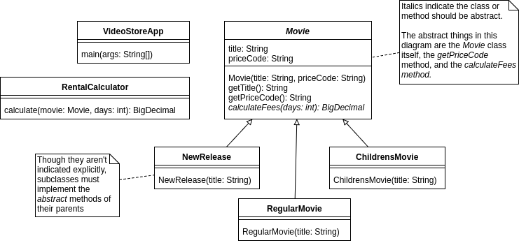

# Video Store

This exercise is adapted from a classic example, the "Replace Conditional with Polymorphism" refactoring found in Fowler's *Refactoring* book.

## Setup

- Fork the existing repository (based on in-class work).
    - [ ] Navigate to https://github.com/WeCanCodeIT/java-video-store in your browser.
    - [ ] Create a fork of this repository to your account via the "Fork" button at the upper right.
- Set up your workspace.
    - [ ] Open Git Bash.
    - [ ] Use `git clone <your-repository-url>` to clone your fork of the repository (**not** the original repository -- the url you use should contain your GitHub username).
    - [ ] Change to the directory of the cloned repository (`cd java-video-store`).
    - [ ] Run `gradle eclipse` to set up your Eclipse project.
    - [ ] Open Eclipse.
    - [ ] Import the project by selecting *File->Import…* then choosing *General/Existing Projects into Workspace*, navigating to and selecting the java-video-store directory.

        Enjoy a trouble-free push of your exercise for submission!

## Current state

Here is a representation of the classes in our current code:

## Phase 1

We already have rental prices being calculated. What we'll do first is to leverage polymorphism, using it instead of a conditional, to simplify calculating rental prices. Here's what our classes should look like after this phase is complete:

### Required Changes

Rather than calculating the fees inside the `calculate` method of `RentalCalculator`, we'll be calculating fees inside the new `calculateFees` method of each `Movie` subclass. To do so, it will be necessary to create (construct) specific types of movies.

**Please complete Phase 1 before moving on to Phase 2.**

## Phase 2

We would like to print out a statement for rentals. To this end, we'll be changing our model to incorporate a `Rental` and `RentalStatement`. You will need to use an appropriate type of `Collection` to store `Rental` instances inside `RentalStatement`. In `VideoStoreApp`'s main method, we will:

- [ ] Create a `RentalStatement` object.
- For each rental, we will:
    - [ ] create a `Rental` object
    - [ ] add this rental to the `RentalStatement` via its `add` method
- [ ] Call `RentalStatement`'s `print` method, which should print the following for each rental:
    - priceCode
    - title
    - days
    - fees

Here is how our classes should look after this is complete:

## Extensions

### Keeping it D(on't)-R(epeat)-Y(ourself)

How can you refactor the `Movie` hierarchy to eliminate duplication in the calculation of fees?

### Write to a file instead of the console

*Method overloading* is the act of creating methods with the same name but different signatures. They must receive different arguments; otherwise, Java won't know which one you're trying to call. Though it is not required, these should do the same thing in spirit. We usually only overload methods to allow them to be called with different parameters.

Overload the `print` method of `RentalStatement`: `System.out` (look at it in Eclipse) is of type `java.io.PrintStream`. Create a second `print` method in `RentalStatement` that accepts a `PrintStream` as a property. Have your existing `print` method call this one with `System.out`. Research how to create a `PrintStream` that writes to a file, then in your app's `main` method, call `print` with this `PrintStream`.

### Read from a file

Read the rented movies from a file which contains the priceCode, title, and days. Research the *design pattern* you might use to instantiate the appropriate type of movie based on its priceCode.

## Submission Link

Here is the submission link for your project: https://goo.gl/forms/5GU5aoUR8m2EGYyG2